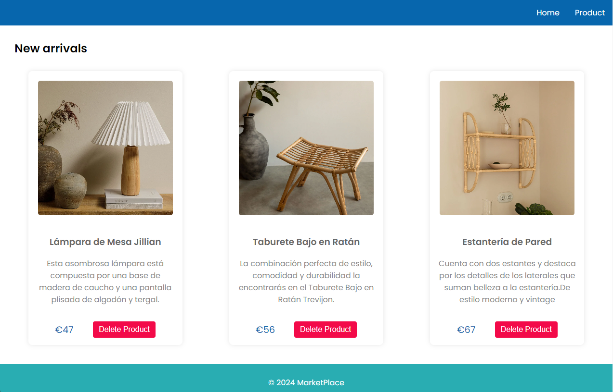

# Marketplace App 
Estructura de la Aplicación
La aplicación Marketplace consta de dos páginas principales y dos componentes fundamentales.

# Home Page
En esta sección, encontrarás todos los productos disponibles en nuestro marketplace.

Utiliza el componente CardProduct para representar todos los productos disponibles en el marketplace.

# Products

- CreateProducts
Proporciona un formulario para dar de alta nuevos productos con los campos: name, image, description y price.

## Componentes
- Componente Menu: 
Renderiza las opciones de menú para navegar entre las páginas Home y CreateProducts.
- Componente CardProduct: 
Representa un producto con los siguientes elementos:
- Título
- Imagen
- Descripción
- Precio
- Botón para eliminar el producto

## Supuestos
