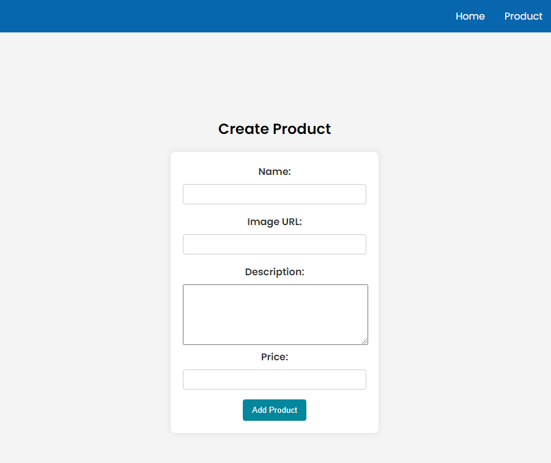

# Prueba Técnica de Cells - Bootcamp HACK A BOSS
# Marketplace App 
Estructura de la Aplicación
La aplicación Marketplace consta de dos páginas principales y dos componentes fundamentales.

# Home Page
En esta sección, encontrarás todos los productos disponibles en nuestro marketplace.

Utiliza el componente CardProduct para representar todos los productos disponibles en el marketplace.

# Products Page

- CreateProducts
Proporciona un formulario para dar de alta nuevos productos con los campos: name, image, description y price.

## Componentes
- Componente HeaderMenu: 
Renderiza las opciones de menú para navegar entre las páginas Home y Products.
- Componente CardProduct: 
Representa un producto con los siguientes elementos:
- Título
- Imagen
- Descripción
- Precio
- Botón para eliminar el producto

## Supuestos
- Agregado de un componente Footer que forma parte de un layout general de la aplicación.
- Generación de IDs de Producto con la Librería UUID:
Se implementó la generación de identificadores únicos para cada producto utilizando la librería UUID. Esto se hizo para asignar un ID único a cada producto al momento de su creación. Estos identificadores son útiles para realizar operaciones específicas en productos individuales, como la eliminación de un producto.

# Manejo del LocalStorage 
## Verificación de Productos en el Local Storage:
- Al cargar el componente, se verifica si hay algún producto almacenado en el Local Storage.
Esto se realiza mediante localStorage.getItem("products"), que intenta recuperar la cadena de texto almacenada bajo la clave "products".

## Carga de Productos Existentes:
- Si se encuentra algún producto en el Local Storage (es decir, storedProducts no es nulo), se procede a cargar esos productos en el componente.
JSON.parse(storedProducts) convierte la cadena JSON almacenada en storedProducts en un objeto JavaScript.
Los productos cargados se asignan a la propiedad products del componente. Esto garantiza que el componente ahora contiene la información más reciente de los productos almacenados.

## Creación y Almacenamiento de Productos Predeterminados:
- Si no se encuentran productos en el Local Storage (es decir, storedProducts es nulo), se crea un conjunto predeterminado de productos.
Estos productos se definen en un array de objetos JavaScript con propiedades como id, name, image, description, y price.
El array de productos se convierte en una cadena JSON mediante JSON.stringify.
Esta cadena JSON se almacena en el Local Storage bajo la clave "products".

## Carga de Productos Predeterminados:
- Después de almacenar los productos predeterminados en el Local Storage, estos productos también se cargan en la propiedad products del componente.
Ahora, el componente tiene datos de productos listos para ser utilizados.

## Persistencia del Estado entre Sesiones:
**Este enfoque permite que el estado de los productos persista entre las sesiones del usuario. Si el usuario cierra la aplicación y la vuelve a abrir, los productos que había creado o modificado seguirán estando disponibles.**


```javascript
  connectedCallback() {
    super.connectedCallback();

    const storedProducts = localStorage.getItem("products");
    if (storedProducts) {
      this.products = JSON.parse(storedProducts);
    } else {
      this.products = [
        {
          id: "bf1fa6ef-bbfc-406c-aaf5-fed45fbfe15d",
          name: "Lámpara de Mesa Jillian",
          image:
            "https://cdn.sklum.com/es/wk/2710942/lampara-de-mesa-en-madera-jillian.jpg?cf-resize=gallery",
          description:
            "Esta asombrosa lámpara está compuesta por una base de madera de caucho y una pantalla plisada de algodón y tergal.",
          price: 47,
        },
        {
          id: "3f51f194-8160-45d4-a50c-9f156adbba09",
          name: "Taburete Bajo en Ratán",
          image:
            "https://cdn.sklum.com/es/wk/2712010/taburete-bajo-en-ratan-trevijon.jpg?cf-resize=gallery",
          description:
            "La combinación perfecta de estilo, comodidad y durabilidad la encontrarás en el Taburete Bajo en Ratán Trevijon.",
          price: 56,
        },
        {
          id: "13010b71-c314-410a-af1a-35c8e2fa1b92",
          name: "Estantería de Pared",
          image:
            "https://cdn.sklum.com/es/wk/2711789/estanteria-de-pared-en-ratan-judson.jpg?cf-resize=gallery",

          description:
            "Cuenta con dos estantes y destaca por los detalles de los laterales que suman belleza a la estantería.De estilo moderno y vintage ",
          price: "67",
        },
      ];

      localStorage.setItem("products", JSON.stringify(this.products));
    }
  }

```
